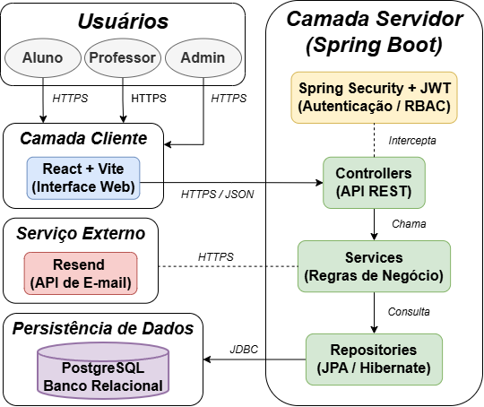
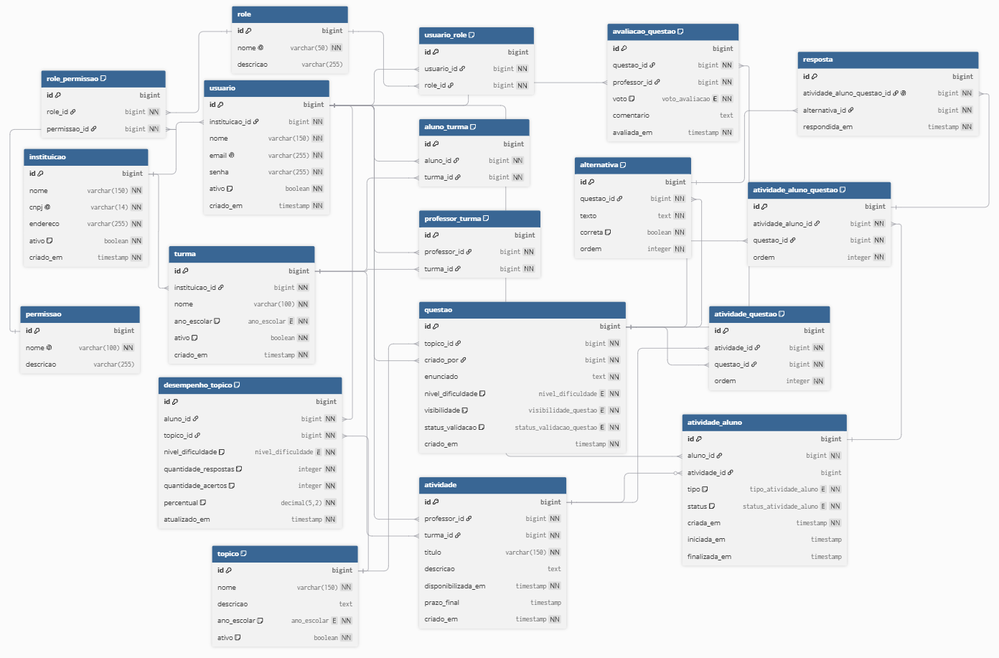

# MaisEdu

Plataforma web de **aprendizagem adaptativa de Matemática** para o Ensino Fundamental II (6º ao 9º ano), com **banco de questões compartilhado** entre instituições de ensino cadastradas.

> Projeto Final de Curso (PFC) — Bacharelado em Engenharia de Software, Universidade de Mogi das Cruzes (UMC).

## Sobre o projeto

O MaisEdu permite que professores criem e organizem questões de Matemática por tópico e ano escolar, submetam-nas a um fluxo de **avaliação colaborativa por pares** e, uma vez aprovadas, as disponibilizem para outras instituições da plataforma. O desempenho de cada aluno é registrado por tópico a partir de suas respostas em atividades regulares e práticas adaptativas, permitindo que um **motor de adaptação** selecione questões direcionadas às maiores dificuldades individuais de cada estudante.

A fundamentação e a arquitetura completas do projeto estão documentadas na monografia do PFC (`/docs`).

## Funcionalidades principais

- Autenticação e controle de acesso baseado em papéis (RBAC) — Administrador, Professor e Aluno
- Banco de questões colaborativo, com submissão, avaliação por pares e compartilhamento entre instituições
- Criação e aplicação de atividades regulares por professores, organizadas por tópico e ano escolar
- Motor de prática adaptativa, que gera exercícios a partir do desempenho do aluno por tópico
- Acompanhamento de desempenho do aluno por tópico ao longo do tempo
- Notificações por e-mail (confirmação de cadastro, redefinição de senha, avaliação de questões pendentes)

## Arquitetura

O sistema segue um modelo cliente-servidor em camadas, com front-end SPA, API REST stateless e persistência relacional.



- **Front-end**: SPA em React, com Vite como ferramenta de build
- **Back-end**: API REST em Spring Boot, organizada em camadas Controller → Service → Repository
- **Autenticação**: Spring Security + JWT, com controle de acesso RBAC
- **Persistência**: PostgreSQL, acessado via Spring Data JPA / Hibernate
- **Serviço externo**: Resend, para envio de e-mails transacionais

## Modelagem de dados

O diagrama entidade-relacionamento está disponível em `docs/diagrams`.



## Tecnologias utilizadas

| Camada | Tecnologia |
|---|---|
| Front-end | React, Vite |
| Back-end | Java, Spring Boot, Spring Data JPA, Hibernate |
| Autenticação | Spring Security, JWT |
| Banco de dados | PostgreSQL |
| Serviço externo | Resend (e-mail transacional) |
| Containerização | Docker |
| Testes | JUnit, Spring Boot Test, Mockito |
| Versionamento | Git, GitHub, GitHub Projects (Kanban) |

## Como executar

> ⚠️ Projeto em desenvolvimento — instruções serão atualizadas conforme a implementação avança.

```bash
# Clonar o repositório
git clone https://github.com/<usuario>/maisedu.git
cd maisedu

# Subir os containers (back-end + banco de dados)
docker compose up -d

# Front-end
cd frontend
npm install
npm run dev
```

Variáveis de ambiente necessárias (`.env`): credenciais do banco de dados PostgreSQL e chave de API do Resend.

## Estrutura do repositório

```
maisedu/
├── backend/          # API REST (Spring Boot)
├── frontend/          # SPA (React + Vite)
├── docs/
│   ├── diagrams/      # Diagrama de arquitetura e diagrama entidade-relacionamento
│   ├── database/       # Script DBML de modelagem de dados
│   └── monografia/     # Documento do PFC
└── docker-compose.yml
```

## Status do projeto

🚧 Em desenvolvimento — fase atual: modelagem de dados e definição de arquitetura concluídas; implementação do back-end e do front-end em andamento.

## Equipe

- Gustavo André dos Passos Chelucci
- Zacarias Alves Lins

## Licença

Projeto acadêmico desenvolvido para fins de Projeto Final de Curso (PFC) da UMC.
